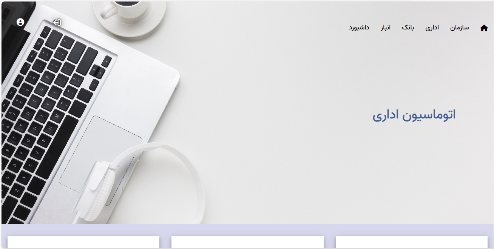

<!-- Improved compatibility of back to top link: See: https://github.com/othneildrew/Best-README-Template/pull/73 -->

<!--
*** Thanks for checking out the Best-README-Template. If you have a suggestion
*** that would make this better, please fork the repo and create a pull request
*** or simply open an issue with the tag "enhancement".
*** Don't forget to give the project a star!
*** Thanks again! Now go create something AMAZING! :D
-->

<!-- PROJECT SHIELDS -->
<!--
*** I'm using markdown "reference style" links for readability.
*** Reference links are enclosed in brackets [ ] instead of parentheses ( ).
*** See the bottom of this document for the declaration of the reference variables
*** for contributors-url, forks-url, etc. This is an optional, concise syntax you may use.
*** https://www.markdownguide.org/basic-syntax/#reference-style-links
-->

<!-- PROJECT LOGO -->
 

  

  <h3 align="center">Java EE Automation</h3>

  

    An automation project using Java EE!
     
    <a href="https://github.com/AhmadMessbah/JavaEE_Automation"><strong>Explore the docs »</strong></a>
     
     
    <a href="https://github.com/AhmadMessbah/JavaEE_Automation">View Demo</a>
    ·
    <a href="https://github.com/AhmadMessbah/JavaEE_Automation">Report Bug</a>
    ·
    <a href="https://github.com/AhmadMessbah/JavaEE_Automation">Request Feature</a>
  

<!-- TABLE OF CONTENTS -->

  
Table of Contents

  <ol>
    <li>
      <a href="#about-the-project">About The Project</a>
      <ul>
        <li><a href="#built-with">Built With</a></li>
      </ul>
    </li>
    <li>
      <a href="#getting-started">Getting Started</a>
      <ul>
        <li><a href="#prerequisites">Prerequisites</a></li>
        <li><a href="#installation">Installation</a></li>
      </ul>
    </li>
    <li><a href="#usage">Usage</a></li>
    <li><a href="#contributing">Contributing</a></li>
    <li><a href="#license">License</a></li>
    <li><a href="#contact">Contact</a></li>
  </ol>

<!-- ABOUT THE PROJECT -->
## About The Project
  

[//]: # ([![]&#40;E:\JavaFinalProject\letter\docs\images\home.png&#41;]&#40;https://example.com&#41;)

This project, is a sample of an automation using Java EE.
In this project we have provided features with regard to basic needs in an office platform -- it is worth a try

Here's why:
* Login is required for all of our pages, a basic rule for an official automation
* Having samples for lettering system and reference them to different users
* Having samples for Bank and Storage management

Of course, there is still room for improvement !

(<a href="#readme-top">back to top</a>)

### Built With

What we used for building this project

* Jakarta EE 10
* TomEE 10.0.27
* Jdk 11
* Oracle Data Base
* Hibernate Orm

(<a href="#readme-top">back to top</a>)

<!-- GETTING STARTED -->
## Getting Started

This is an example of how you may set up this project.
To get a local copy up and running follow these simple example steps.

### Prerequisites

These are required changes for your TomEE

Open tomee.xml,
Add code below as required jdbc/JtaDataSource
<?xml version = "1.0" encoding = "UTF-8"?>
<tomee>

    <Resource id = "jdbc/JtaDataSource" type = "javax.sql.DataSource">
        jdbcDriver = oracle.jdbc.driver.OracleDriver
        jdbcUrl = jdbc:oracle:thin:@localhost:1521:xe
        username = mft
        password = java123
        jtaManaged = true
        maxIdle = 20
        minIdle = 5
        maxWait = 10000
    </Resource>
    <Resource id = "jdbc/NonJtaDataSource" type = "javax.sql.DataSource">
        jdbcDriver = oracle.jdbc.driver.OracleDriver
        jdbcUrl = jdbc:oracle:thin:@localhost:1521:xe
        username = mft
        password = java123
        jtaManaged = false
        maxIdle = 20
        minIdle = 5
        maxWait = 10000
    </Resource>
</tomee>

Next open server.xml,
Add code below as required realm settings

    <Realm className="org.apache.catalina.realm.DataSourceRealm"
        dataSourceName="jdbc/JtaDataSource"
            userTable="user_tbl"
            userNameCol="u_username"
            userCredCol="u_password"
            userRoleTable="roles_tbl"
            roleNameCol="role_name"/>

### Installation

Below is what you need to have already installed

1. apache-tomee-webprofile-9.1.2
2. Jdk 11
3. Oracle db

(<a href="#readme-top">back to top</a>)

<!-- USAGE EXAMPLES -->
## Usage

This automation could be used as an official application.

(<a href="#readme-top">back to top</a>)

<!-- CONTRIBUTING -->
## Contributing

Contributions are what make the open source community such an amazing place to learn, inspire, and create. Any contributions you make are **greatly appreciated**.

If you have a suggestion that would make this better, please fork the repo and create a pull request. You can also simply open an issue with the tag "enhancement".
Don't forget to give the project a star! Thanks again!

1. Fork the Project
2. Create your Feature Branch (`git checkout -b feature/AmazingFeature`)
3. Commit your Changes (`git commit -m 'Add some AmazingFeature'`)
4. Push to the Branch (`git push origin feature/AmazingFeature`)
5. Open a Pull Request

(<a href="#readme-top">back to top</a>)

<!-- LICENSE -->
## License

Distributed under the MFT plus License. See <a href="https://mftplus.com/">mftplus.com</a> for more information.

(<a href="#readme-top">back to top</a>)

<!-- CONTACT -->
## Contact

Contact Us - ahadzadeparnian@gmail.com

Project Link: [https://github.com/AhmadMessbah/JavaEE_Automation](https://github.com/AhmadMessbah/JavaEE_Automation)

(<a href="#readme-top">back to top</a>)

<!-- MARKDOWN LINKS & IMAGES -->
<!-- https://www.markdownguide.org/basic-syntax/#reference-style-links -->
[contributors-shield]: https://img.shields.io/github/contributors/othneildrew/Best-README-Template.svg?style=for-the-badge
[contributors-url]: https://github.com/othneildrew/Best-README-Template/graphs/contributors
[forks-shield]: https://img.shields.io/github/forks/othneildrew/Best-README-Template.svg?style=for-the-badge
[forks-url]: https://github.com/othneildrew/Best-README-Template/network/members
[stars-shield]: https://img.shields.io/github/stars/othneildrew/Best-README-Template.svg?style=for-the-badge
[stars-url]: https://github.com/othneildrew/Best-README-Template/stargazers
[issues-shield]: https://img.shields.io/github/issues/othneildrew/Best-README-Template.svg?style=for-the-badge
[issues-url]: https://github.com/othneildrew/Best-README-Template/issues
[license-shield]: https://img.shields.io/github/license/othneildrew/Best-README-Template.svg?style=for-the-badge
[license-url]: https://github.com/othneildrew/Best-README-Template/blob/master/LICENSE.txt
[linkedin-shield]: https://img.shields.io/badge/-LinkedIn-black.svg?style=for-the-badge&logo=linkedin&colorB=555
[linkedin-url]: https://linkedin.com/in/othneildrew
[product-screenshot]: images/screenshot.png
[Next.js]: https://img.shields.io/badge/next.js-000000?style=for-the-badge&logo=nextdotjs&logoColor=white
[Next-url]: https://nextjs.org/
[React.js]: https://img.shields.io/badge/React-20232A?style=for-the-badge&logo=react&logoColor=61DAFB
[React-url]: https://reactjs.org/
[Vue.js]: https://img.shields.io/badge/Vue.js-35495E?style=for-the-badge&logo=vuedotjs&logoColor=4FC08D
[Vue-url]: https://vuejs.org/
[Angular.io]: https://img.shields.io/badge/Angular-DD0031?style=for-the-badge&logo=angular&logoColor=white
[Angular-url]: https://angular.io/
[Svelte.dev]: https://img.shields.io/badge/Svelte-4A4A55?style=for-the-badge&logo=svelte&logoColor=FF3E00
[Svelte-url]: https://svelte.dev/
[Laravel.com]: https://img.shields.io/badge/Laravel-FF2D20?style=for-the-badge&logo=laravel&logoColor=white
[Laravel-url]: https://laravel.com
[Bootstrap.com]: https://img.shields.io/badge/Bootstrap-563D7C?style=for-the-badge&logo=bootstrap&logoColor=white
[Bootstrap-url]: https://getbootstrap.com
[JQuery.com]: https://img.shields.io/badge/jQuery-0769AD?style=for-the-badge&logo=jquery&logoColor=white
[JQuery-url]: https://jquery.com 
